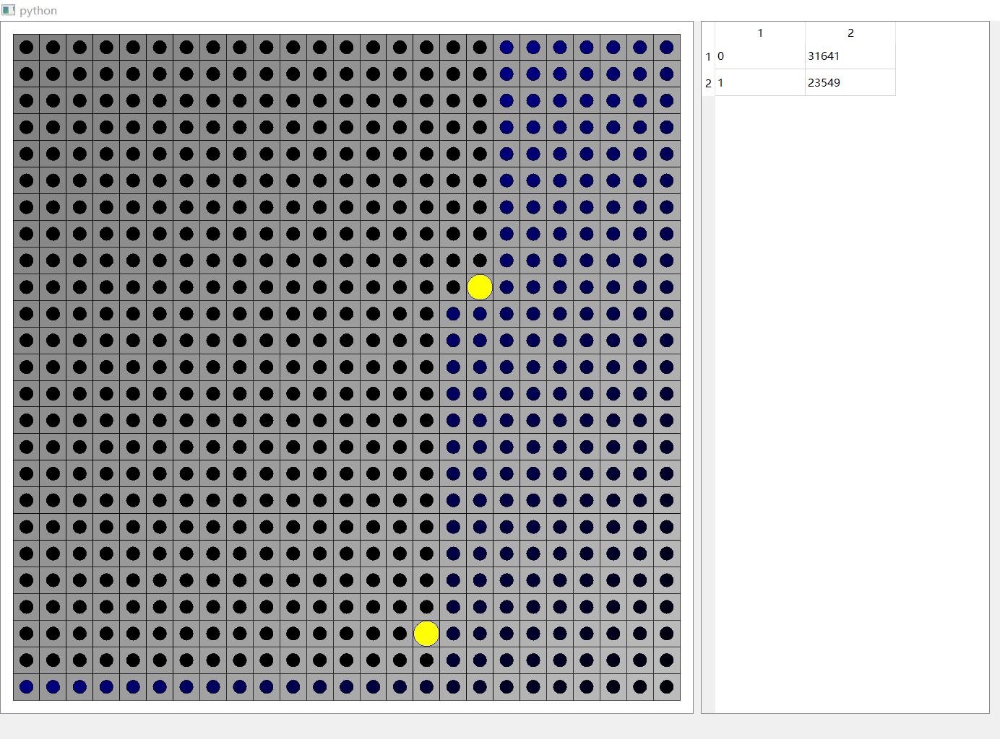

# 简介
这是一个沙盒编程游戏。

# 世界观
* 世界(World)大小有限，二维离散坐标；
* 每个坐标具有高度和能量；
* 个体(Entity)拥有能量(Energy)属性和坐标属性；
* 世界不断地更新，个体不断消耗能量；
* 个体可以感知世界的信息，并采取行动(Act)；
* 个体的行动需要消耗一定的能量，如果个体能量不足，将无视行动请求（以后考虑直接杀死个体）；
* 能量小于等于0的个体将永久死亡。

# 目标
* 得到足够的能量生存下来；
* 利用full python support做一些有趣的事情。

# 游戏方式
通过编写程序控制世界的更新方式和个体的行动规则及其他。
在[worlds/default/](https://github.com/faultrit/DigitalWorld/tree/master/worlds/default)及[entities/default](https://github.com/faultrit/DigitalWorld/tree/master/entities/default)下查看示例。
## 创建你的world
为你的世界取一个名字world_name，在worlds/下创建名为world_name的文件夹。
你应该在world_name文件夹下编写你的世界（的初始化和更新规则）。程序将根据world_name/main.py中的init及update函数对世界进行初始化和更新。
## 创建你的entity
为你的个体取一个名字entity_name，在entities/下创建名为entity_name的文件夹。
你应该在entity_name文件夹下编写你的个体（的初始化和更新规则）。程序将根据entity_name/main.py中的init及act函数初始化和运行个体。
## 然后呢
执行monitor.py。

# 效果预览

# 注意
目前尚未完成基础的开发工作，程序启动后自动加载default世界和entity并运行。
需要安装pyqt5。
**最近太忙了，暂停开发**
